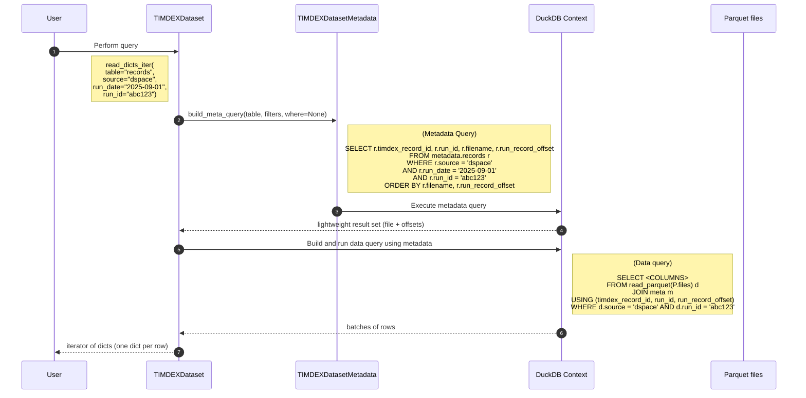

# Reading data from TIMDEXDataset

This guide explains how `TIMDEXDataset` read methods work and how to use them effectively.

- `TIMDEXDataset` and `TIMDEXDatasetMetadata` both maintain an in-memory DuckDB context. You can issue DuckDB SQL against the views/tables they create.
- Read methods use a two-step query flow for performance:
  1) a metadata query determines which Parquet files and row offsets are relevant
  2) a data query reads just those rows and returns the requested columns
- Prefer simple key/value `DatasetFilters` for most use cases; add a `where=` SQL predicate when you need more advanced logic (e.g., ranges, `BETWEEN`, `>`, `<`, `IN`).

## Available read methods

- `read_batches_iter(...)`: yields `pyarrow.RecordBatch`
- `read_dicts_iter(...)`: yields Python `dict` per row
- `read_dataframe(...)`: returns a pandas `DataFrame`
- `read_dataframes_iter(...)`: yields pandas `DataFrame` batches
- `read_transformed_records_iter(...)`: yields `transformed_record` dictionaries only

All accept the same `DatasetFilters` and the optional `where=` SQL predicate.

## Filters vs. where=

- `DatasetFilters` are key/value arguments on read methods. They are validated and translated into SQL and will cover most queries.
  - Examples: `source="alma"`, `run_date="2024-12-01"`, `run_type="daily"`, `action="index"`
- `where=` is an optional raw SQL WHERE predicate string, combined with `DatasetFilters` using `AND`. Use it for:
  - date/time ranges (BETWEEN, >, <)
  - set membership (IN (...))
  - complex boolean logic (AND/OR grouping)

Important: `where=` must be only a WHERE predicate (no `SELECT`/`FROM`/`;`). The library plugs it into generated SQL.

## How reading works (two-step process)

1) Metadata query
   - Runs against `TIMDEXDatasetMetadata` views (e.g., `metadata.records`, `metadata.current_records`)
   - Produces a small result set with identifiers: `filename`, row group/offsets, and primary keys
   - Greatly reduces how much data must be scanned

2) Data query
   - Uses DuckDB to read only relevant Parquet fragments based on metadata results
   - Joins the metadata identifiers to return the exact rows requested
   - Returns batches, dicts, or a `DataFrame` depending on the method

This pattern keeps reads fast and memory-efficient even for large datasets.

The following diagram shows the flow for a query like:

```python
for record_dict in td.read_dicts_iter(table="records", source="dspace", run_date="2025-09-01", run_id="abc123"):
    # process record...
```




## Quick start examples

```python
from timdex_dataset_api import TIMDEXDataset

td = TIMDEXDataset("s3://my-bucket/timdex-dataset")  # example instance

# 1) Get a single record as a dict
first = next(td.read_dicts_iter())

# 2) Read batches with simple filters
for batch in td.read_batches_iter(source="alma", run_date="2025-06-01", run_id="abc123"):
    ...  # process pyarrow.RecordBatch

# 3) DataFrame of one run
df = td.read_dataframe(source="dspace", run_date="2025-06-01", run_id="def456")

# 4) Only transformed records (used by indexer)
for rec in td.read_transformed_records_iter(source="aspace", run_type="daily"):
    ...  # rec is a dict of the transformed_record
```

## `where=` examples

Advanced filtering that complements `DatasetFilters`.

```python
# date range with BETWEEN
where = "run_date BETWEEN '2024-12-01' AND '2024-12-31'"
df = td.read_dataframe(source="alma", where=where)

# greater-than on a timestamp (if present in columns)
where = "run_timestamp > '2024-12-01T10:00:00Z'"
df = td.read_dataframe(source="aspace", run_type="daily", where=where)

# combine set membership and action
where = "run_id IN ('run-1', 'run-3', 'run-5') AND action = 'index'"
df = td.read_dataframe(source="alma", where=where)

# combine filters (AND) with where=
where = "run_type = 'daily' AND action = 'index'"
df = td.read_dataframe(source="libguides", where=where)
```

Validation tips:
- Use only a predicate (no SELECT/FROM, no trailing semicolon).
- Column names must exist in the target table/view (e.g., records or current_records).
- `DatasetFilters` + `where=` are ANDed; if the combination yields zero rows, you’ll get an empty result.

## Choosing a table

By default, read methods query the `records` view (all versions). To get only the latest version per `timdex_record_id`, target the `current_records` view:

```python
# ALL records in the 'libguides' source
all_libguides_df = td.read_dataframe(table="records", source="libguides")

# latest unique records across the dataset
current_df = td.read_dataframe(table="current_records")

# current records for a source and specific run
current_df = td.read_dataframe(table="current_records", source="alma", run_id="run-5")
```

## DuckDB context

- `TIMDEXDataset` exposes a DuckDB connection used for data queries against Parquet.
- `TIMDEXDatasetMetadata` exposes a DuckDB connection used for metadata queries and provides views:
  - `metadata.records`: all record versions with run metadata
  - `metadata.current_records`: latest record per `timdex_record_id`
  - `metadata.append_deltas`: incremental write tracking

You can execute raw DuckDB SQL for inspection and debugging:

```python
# access metadata connection
conn = td.metadata.conn  # DuckDB connection

# peek at view schemas
print(conn.sql("DESCRIBE metadata.records").to_df())
print(conn.sql("DESCRIBE metadata.current_records").to_df())

# ad-hoc query (read-only)
debug_df = conn.sql("""
    SELECT source, action, COUNT(*) as n
    FROM metadata.records
    WHERE run_date = '2024-12-01'
    GROUP BY 1, 2
    ORDER BY n DESC
""").to_df()
```

## Performance notes

- Batch iterators (`read_batches_iter()` / `read_dataframes_iter()`) stream results to control memory.
- `read_dataframe()` loads ALL matching rows into memory; fine for small/filtered sets but can easily overwhelm memory for large result sets
- Tuning via env vars (advanced): `TDA_READ_BATCH_SIZE`, `TDA_DUCKDB_THREADS`, `TDA_DUCKDB_MEMORY_LIMIT`.

## Troubleshooting

- Empty results? Check that filters and `where=` don’t over-constrain your query.
- Syntax errors? Ensure `where=` is a valid predicate and references existing columns.
- Large scans? Make sure to use `_iter()` read methods.
